# Đánh Giá Website Booking — Kenhi Homestay Huế

**URL:** https://kenhihomestay.orchidpremiumhotel.com/  
**Ngày đánh giá:** 04/03/2026  
**Phạm vi:** Trang chủ, Danh sách phòng, Chi tiết phòng, Giới thiệu, Liên hệ, Blog  

---

## Bảng Tổng Kết Điểm

| Tiêu chí | Điểm (1-10) | Mức đánh giá |
| --- | :---: | --- |
| UI/UX & Visual Design | **5.5** | Trung bình |
| Information Architecture & Navigation | **6.0** | Trung bình |
| Booking Flow & Conversion | **3.0** | Kém |
| Content Quality & Trust Signals | **4.0** | Kém |
| Mobile Responsiveness | **4.0** | Kém |
| SEO & Technical | **4.5** | Kém |
| **TỔNG ĐIỂM TRUNG BÌNH** | **4.5/10** | **Cần cải thiện nhiều** |

---

## 1. UI/UX & Visual Design — 5.5/10

### Screenshot trang chủ desktop

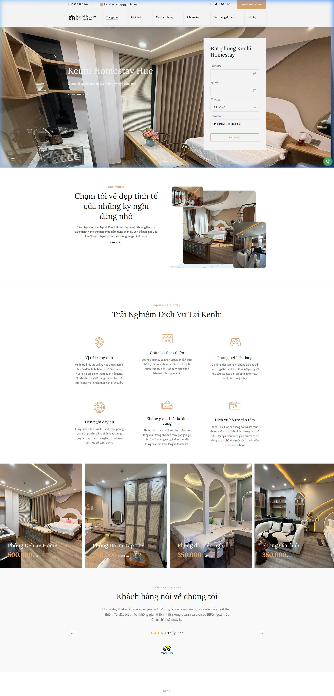

### Ưu điểm

- Tông màu nâu đồng - xám - trắng tạo cảm giác sang trọng, ấm cúng, phù hợp phong cách homestay Huế
- Ảnh phòng chất lượng cao, thể hiện tốt không gian thực tế
- Font chữ Serif cho tiêu đề tạo nét cổ điển, thanh lịch

### Vấn đề (Nguyên nhân cảm giác "rời rạc")

**Spacing (khoảng cách) không đồng nhất** — Đây là nguyên nhân chính tạo cảm giác rời rạc.

| Vấn đề | Vị trí | Mức độ |
| --- | --- | --- |
| Khoảng trắng quá lớn giữa Hero → Giới thiệu | Section 1-2 | Cao |
| Khoảng trắng quá lớn giữa Dịch vụ → Danh sách phòng | Section 3-4 | Cao |
| Nút CTA không đồng bộ (3 style khác nhau) | Toàn trang | Trung bình |
| Ngôn ngữ trộn lẫn "BOOKING NOW" vs "Đặt ngay" | Header, Form | Trung bình |

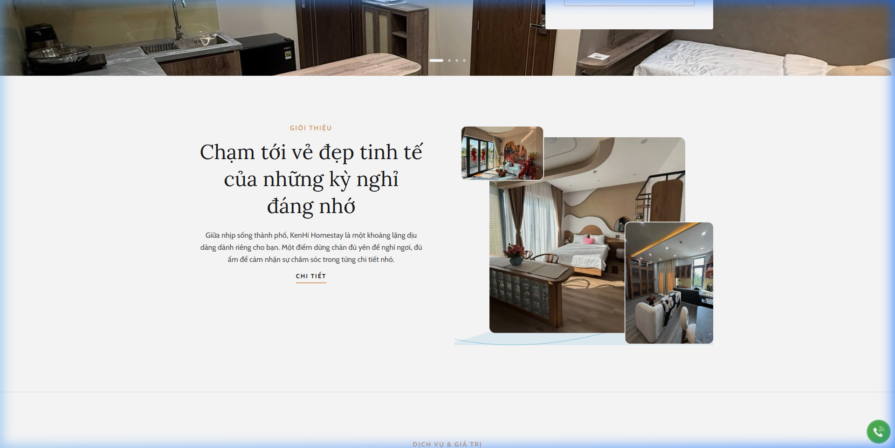

---

## 2. Information Architecture & Navigation — 6.0/10

### Cấu trúc menu

```
Trang chủ | Giới thiệu | Các loại phòng | Album Ảnh | Cẩm nang du lịch | Liên hệ
```

### Ưu điểm

- Menu rõ ràng, đủ các mục cần thiết cho một trang booking
- Sticky header giữ navigation luôn hiển thị
- Breadcrumb có trên các trang con

### Vấn đề

- **"Booking Now" ở header** trỏ về **chính trang hiện tại** (href = URL trang đang xem) — không dẫn đến bất kỳ booking flow nào
- Thiếu trang FAQ (Câu hỏi thường gặp)
- Thiếu trang Chính sách (hủy phòng, nhận/trả phòng)
- Thanh bar liên hệ trùng lặp thông tin (SĐT + email xuất hiện 2 lần ở header)

---

## 3. Booking Flow & Conversion — 3.0/10

**Đây là điểm yếu nghiêm trọng nhất.** Toàn bộ các nút kêu gọi hành động (CTA) đặt phòng đều không hoạt động.

### Các lỗi nghiêm trọng

| Nút / Link | Vị trí | Lỗi |
| --- | --- | --- |
| "BOOKING NOW" | Header top bar | href trỏ về URL trang hiện tại |
| "KHÁM PHÁ NGAY" | Hero section | href="#" — không hoạt động |
| "ĐẶT PHÒNG NGAY" | Trang chi tiết phòng | href="#" — không hoạt động |
| "ĐẶT NGAY" | Form tìm kiếm trang chủ | Chưa verify form submit |
| "Đặt phòng ngay" (link) | Card phòng | Trỏ đúng → trang phòng |

### Hành trình khách hàng bị đứt gãy

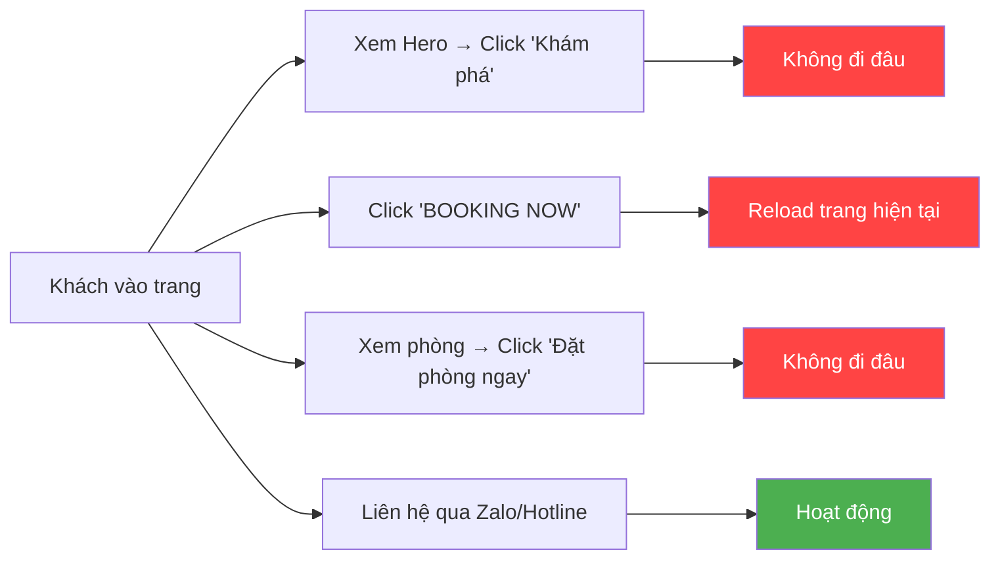

**Kết luận:** Cách duy nhất khách có thể đặt phòng là qua Zalo/Hotline từ floating bar.

---

## 4. Content Quality & Trust Signals — 4.0/10

### Các lỗi nội dung phát hiện

**Trang Liên hệ còn nội dung Lorem ipsum** — Cực kỳ thiếu chuyên nghiệp.

| Lỗi | Vị trí | Mức độ |
| --- | --- | --- |
| **Lorem ipsum** dưới tiêu đề "Liên hệ" | /lien-he/ | Nghiêm trọng |
| **Fax: +(12) 345 67890** — số demo giả, không phải số thật | /lien-he/ | Nghiêm trọng |
| Bài **"Hello world!"** chưa xóa | Blog / Cẩm nang | Nghiêm trọng |
| Tag **"UNCATEGORIZED"** hiển thị trên bài Hello World | Blog | Trung bình |
| Footer "Đặt phòng qua điện thoại" → chỉ có ô nhập **Email** | Footer | Sai ngữ cảnh |
| document.write(new Date().getFullYear()) hiển thị text thô | Copyright | Trung bình |

### Trust Signals

| Yếu tố | Trạng thái |
| --- | --- |
| SSL Certificate (HTTPS) | Có |
| Đánh giá khách hàng (Testimonials) | Có (3 review) |
| Google Maps nhúng | Không có |
| Giấy phép kinh doanh | Không có |
| Rating từ TripAdvisor/Booking.com | Chỉ có logo, chưa liên kết |
| Chính sách hủy/hoàn tiền | Không có |
| Địa chỉ chi tiết | Có |

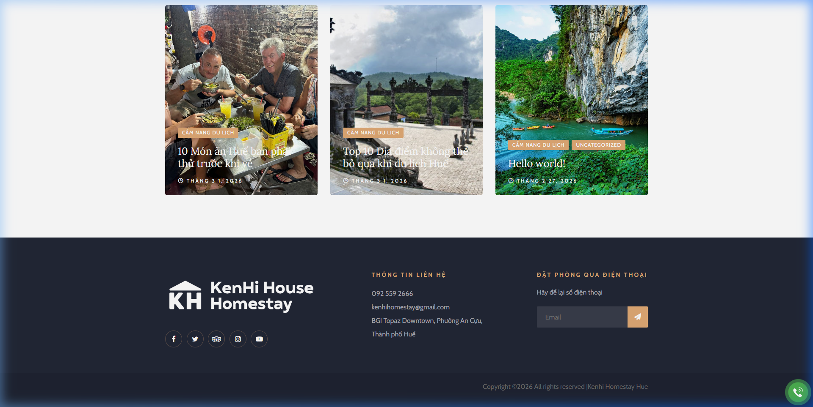

---

## 5. Mobile Responsiveness — 4.0/10

### Header mobile chiếm ~35% màn hình

**Header/Logo chiếm ~35-40% viewport trên mobile** — chuẩn UX chỉ nên chiếm 10-15%. Đây là lỗi nghiêm trọng khiến nội dung chính (ảnh phòng, form booking) bị đẩy xuống dưới màn hình đầu tiên.

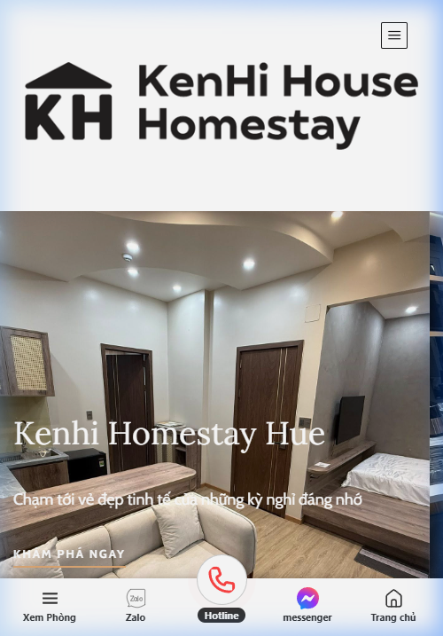

| So sánh | Kenhi Homestay | Chuẩn UX |
| --- | --- | --- |
| Chiều cao header mobile | **~35-40%** viewport | **10-15%** viewport |
| Logo size | Quá lớn, không responsive | Thu nhỏ theo viewport |
| Nội dung above-the-fold | Chỉ thấy logo + hamburger | Nên thấy hero + CTA |

### Screenshots trang chi tiết phòng trên mobile

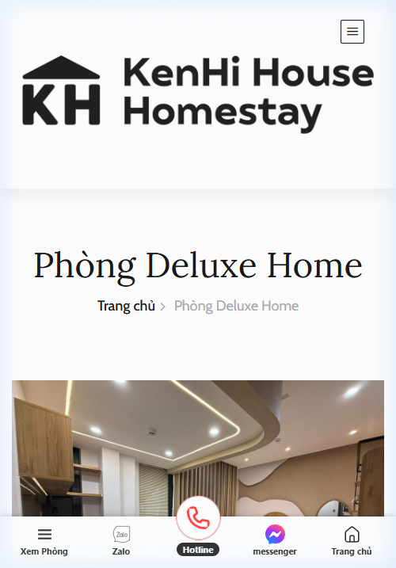

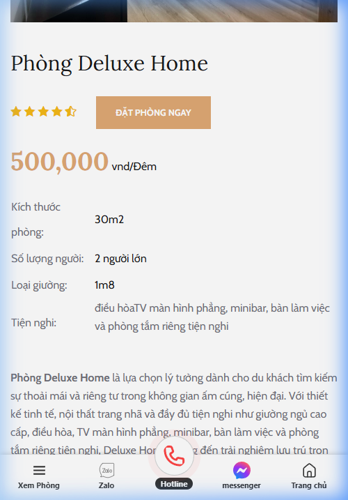

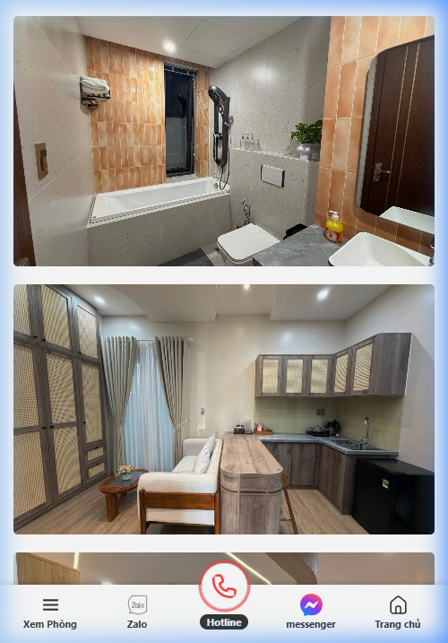

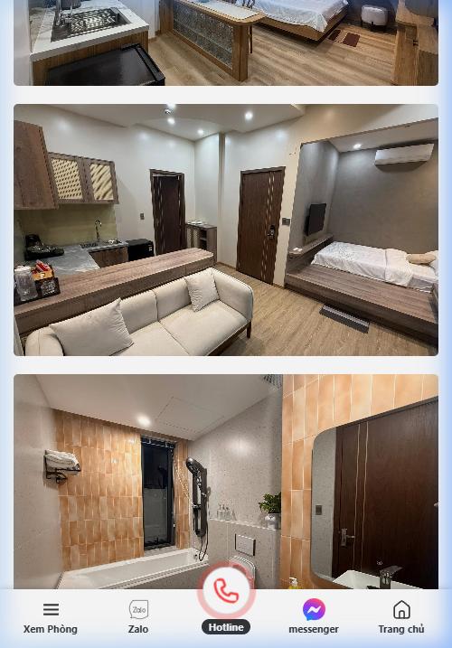

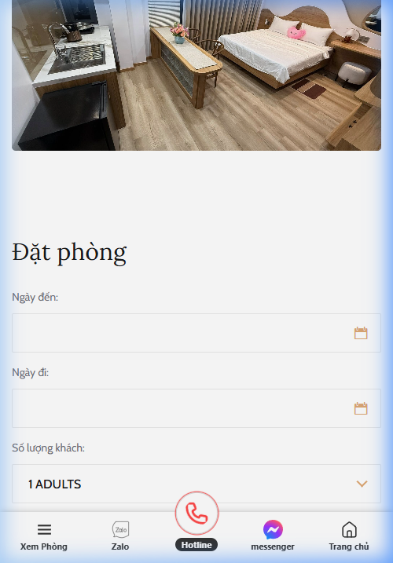

### Ưu điểm

- Hamburger menu hoạt động trên mobile
- Floating bottom bar (Hotline, Zalo, Messenger) hữu ích cho mobile
- Ảnh responsive, scale đúng viewport

### Vấn đề

- **Header/Logo quá to** — chiếm ~35% viewport, đẩy toàn bộ nội dung quan trọng xuống dưới fold
- **Sidebar menu mobile thiết kế kém** — Khi mở hamburger menu, sidebar chiếm gần hết viewport nhưng chỉ hiển thị 6 menu item với khoảng cách quá lớn giữa các mục (~60-70px mỗi item). Thêm vào đó: ô search ở trên cùng (không cần thiết cho một homestay nhỏ), nút "BOOKING NOW" nằm trên cùng nhưng không hoạt động, social icons + SĐT + email đặt ở dưới cùng khiến sidebar phải cuộn. Cần thu gọn spacing, bỏ ô search, đặt thông tin liên hệ gần CTA hơn.
- **Ảnh gallery** trên trang chi tiết phòng xếp chồng dọc → cuộn rất dài, không có slideshow
- **Booking form** bị đẩy xuống cuối trang → khách khó tìm
- Tiện ích phòng liệt kê dạng text liền thay vì icon + danh sách → khó đọc trên mobile
- Khoảng trắng lớn vẫn tồn tại → cuộn nhiều mà ít nội dung

---

## 6. SEO & Technical — 4.5/10

| Tiêu chí SEO | Trạng thái |
| --- | --- |
| Title tag | "Kenhi Homestay Huế" — quá ngắn, thiếu keywords |
| Meta description | Không thấy (hoặc mặc định) |
| H1 heading | "Kenhi Homestay Hue" — chỉ 1 H1 |
| Alt text cho ảnh | Cần kiểm tra |
| Bài "Hello world" | Gây hại SEO (nội dung rác) |
| URL structure | Tốt, slug tiếng Việt có dấu rõ ràng |
| Canonical URL | Cần kiểm tra |
| Sitemap | Chưa verify |
| Schema markup (Hotel/Lodging) | Không có |

---

## Screenshots bổ sung

### Section Dịch vụ & Giá trị

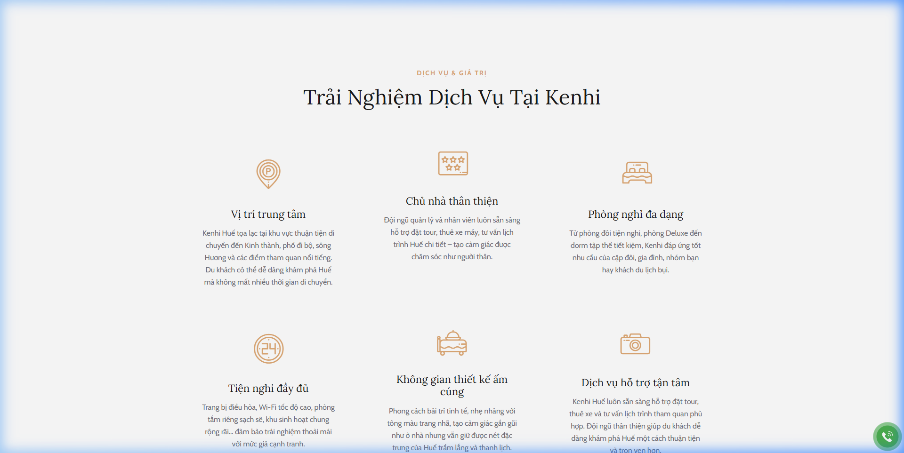

---

## Cách Đánh Giá Website Booking Chuẩn — 5 Cột Trụ

Khi đánh giá bất kỳ website booking nào, hãy dùng 5 trụ cột sau:

### 1. Clarity (Sự rõ ràng)

Khách có biết ngay mình đang ở đâu, homestay cung cấp gì, và cách đặt phòng?

- Tên, logo, hình ảnh rõ ràng
- CTA đặt phòng không hoạt động → mất rõ ràng về hành động tiếp theo

### 2. Efficiency (Hiệu quả chuyển đổi)

Từ lúc vào trang → đặt phòng xong mất bao nhiêu bước?

- Hiện tại không có flow đặt phòng online hoàn chỉnh
- Phải gọi điện/Zalo → tăng rào cản chuyển đổi

### 3. Trust (Độ tin cậy)

Có đủ yếu tố khiến khách tin tưởng bỏ tiền đặt phòng?

- Có review nhưng ít (3 reviews)
- Thiếu Google Maps, giấy phép, chính sách rõ ràng
- Lorem ipsum & Hello World phá hỏng niềm tin

### 4. Visuals (Hình ảnh trực quan)

Ảnh phòng có khiến khách muốn ở không?

- Ảnh đẹp, chất lượng cao, thể hiện tốt không gian
- Cách trình bày gallery kém (xếp chồng dọc, không slider)

### 5. Responsiveness (Tương thích đa thiết bị)

70%+ khách đặt qua di động — trang có mượt trên mobile không?

- Hoạt động cơ bản nhưng cuộn quá dài
- Booking form bị chìm ở cuối trang

---

## Đề Xuất Cải Thiện — Theo Mức Ưu Tiên

### Ưu tiên tối cao (Sửa ngay)

1. **Sửa tất cả nút CTA** — "BOOKING NOW", "KHÁM PHÁ NGAY", "ĐẶT PHÒNG NGAY" phải dẫn đến form đặt phòng hoặc trang liên hệ
2. **Thu nhỏ header/logo trên mobile** — giảm từ ~35% xuống ≤15% viewport (logo nhỏ hơn, bỏ padding thừa)
3. **Xóa Lorem ipsum** ở trang Liên hệ, thay bằng nội dung thực
4. **Xóa bài "Hello world!"** khỏi blog
5. **Việt hóa đồng bộ** — "BOOKING NOW" → "ĐẶT PHÒNG"

### Ưu tiên cao (Trong tuần)

1. **Tối ưu spacing** giữa các section — giảm khoảng trắng vô nghĩa
2. **Thêm image slider/lightbox** cho gallery phòng thay vì xếp chồng
3. **Thêm Google Maps** vào trang Liên hệ hoặc Footer
4. **Sửa footer** — "Đặt phòng qua điện thoại" mà form lại hỏi Email → logic sai
5. **Thêm trang chính sách** — nhận phòng/trả phòng, hủy, hoàn tiền

### Ưu tiên trung bình (Trong tháng)

1. **Thêm Schema markup** (Hotel/LodgingBusiness) cho SEO
2. **Bổ sung meta description** cho tất cả trang
3. **Cải thiện tiện ích phòng** — dùng icon + danh sách thay vì text liền
4. **Tích hợp đánh giá** từ TripAdvisor/Booking.com/Google Reviews
5. **Thêm trang FAQ** giải đáp thắc mắc khách hàng
6. **Đồng bộ style nút CTA** — 1 style duy nhất cho tất cả nút đặt phòng
